## Overview of Project

### Purpose

Alphabet Soup is a nonprofit foundation dedicated to helping organizations that protect the environment, improve people's wellbeing and unify the world. The company raises and donates money to invest in lifesaving technologies and organize resource station groups around the world. The purpose of the project is to use machine learning and neural networks to create a binary classifier that is capable of predicting whether applicants will be successful if funded by Alphabet Soup by examining data from over 34,000 organizations that have received funding from Alphabet Soup in the past. These results will help clarify which charities are worth funding and which organizations are too high risk.

## Results

### Data Preprocessing

- The target column for the model is ~IS_SUCCESSFUL~.

- The features for the model are:

	- `APPLICATION_TYPE`
	- `AFFILIATION`
	- `CLASSIFICATION`
	- `USE_CASE`
	- `ORGANIZATION`
	- `STATUS`
	- `INCOME_AMT`
	- `SPECIAL_CONSIDERATIONS`
	- `ASK_AMT`

- The `EIN` and `ID` columns were not necessary and were removed from the model.

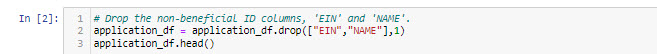

- The `APPLICATION_TYPE` field was binned and data points for `APPLICATION_TYPE` < 528 were grouped into the "Other" category.

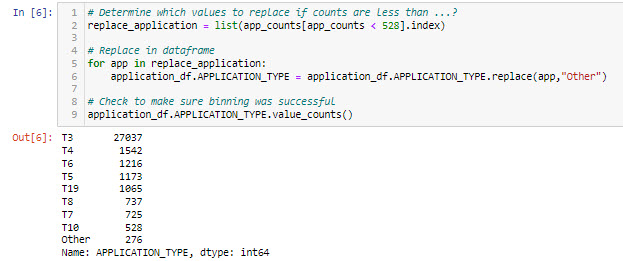

- The `CLASSIFICATION` field was binned and data points for `CLASSIFICATION` < 1883 were grouped into the `Other` category.

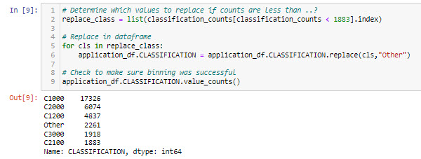

- Categorical data was transformed using OneHotEncoder into numerical categories and the original columns were dropped.

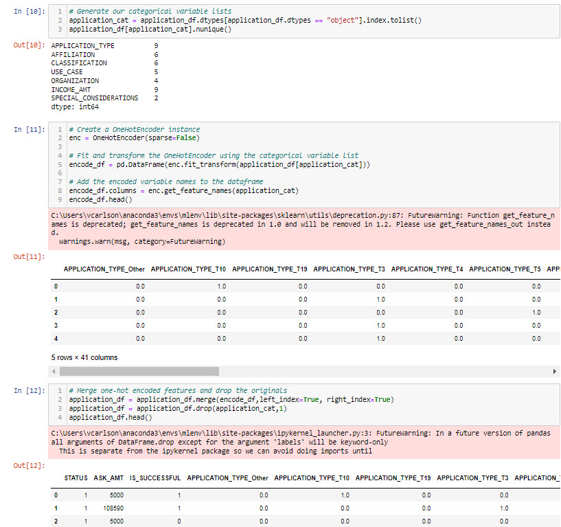

- The data was split into feature and target arrays, then into a training and testing dataset. The data was then scaled to normalize the data.

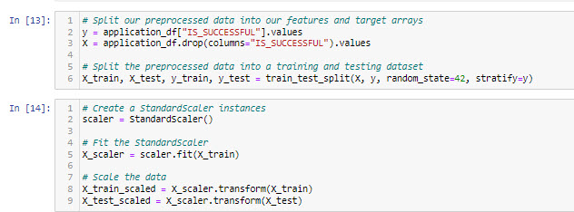

### Compiling, Training, and Evaluating the Model

#### Define and Compile the Model, Create a Callback to Save Weights Every 5th Epoch

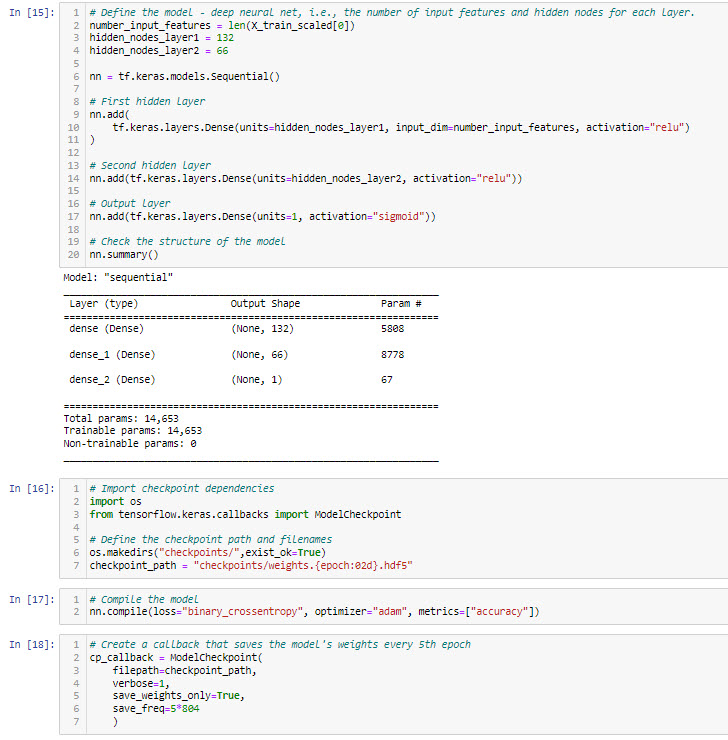

#### Train, Evaluate and Export the Model to HDF5 File

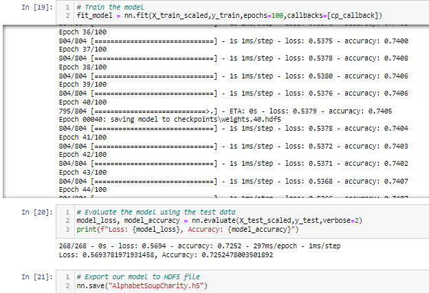

#### How many neurons, layers, and activation functions did you select for your neural network model, and why?

##### Original File

- There were two hidden layers
	- Layer 1: 132 neurons (44 inputs * 3). The number of neurons should be 2-3 times the number of inputs
	- Layer 2: 66 neurons (half of layer 1)
	- Activation function: ReLu (). ReLu is the most used activation function in neural networks due to its simplifying output.
	- Activation function (output layer): Sigmoid. The sigmoid activation function is used for binary outputs (`IS_SUCCESSFUL`=Yes/No).
	- Accuracy: 0.7252

#### Were you able to achieve the target model performance?

I was not successful in achieving the target model performance of 75% in any of the attempts. 

- Accuracy Scores
	- Original accuracy: 0.7252
	- Attempt #1: 0.7237
	- Attempt #2: 0.7249
	- Attempt #3: 0.7237
	- Attempt #4: 0.7243 

#### What steps did you take to try and increase model performance?

##### Attempt #1: Add an Additional Layer

- There were three hidden layers
	- Layer 1: 132 neurons (44 inputs * 3). The number of neurons should be 2-3 times the number of inputs
	- Layer 2: 66 neurons (half of layer 1)
	- Layer 3: 33 neurons (half of layer 2)
	- Activation function (input layers): ReLu (). ReLu is the most used activation function in neural networks due to its simplifying output.
	- Activation function (output layer): Sigmoid. The sigmoid activation function is used for binary outputs (`IS_SUCCESSFUL`=Yes/No).
	- Accuracy: 0.7237. Not successful in achieving model performance of 75%.

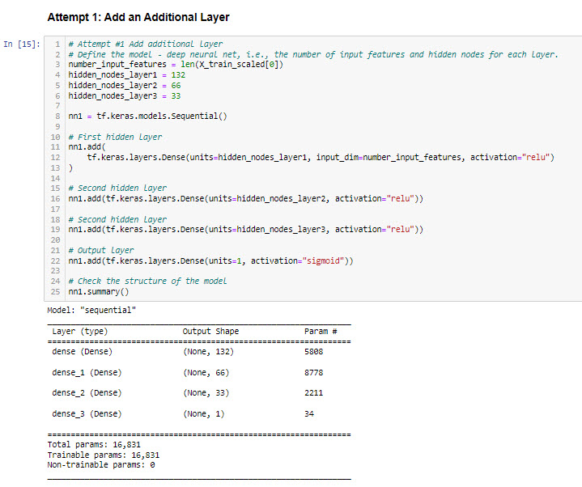

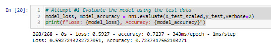

##### Attempt #2: Change the Number of Neurons

- There were three hidden layers
	- Layer 1: 200. Increased from 132 in Attempt #1.
	- Layer 2: 100 neurons (half of layer 1)
	- Layer 3: 50 neurons (half of layer 2)
	- Activation function (input layers): ReLu (). ReLu is the most used activation function in neural networks due to its simplifying output.
	- Activation function (output layer): Sigmoid. The sigmoid activation function is used for binary outputs (`IS_SUCCESSFUL`=Yes/No).
	- Accuracy: 0.7249. Not successful in achieving model performance of 75%.

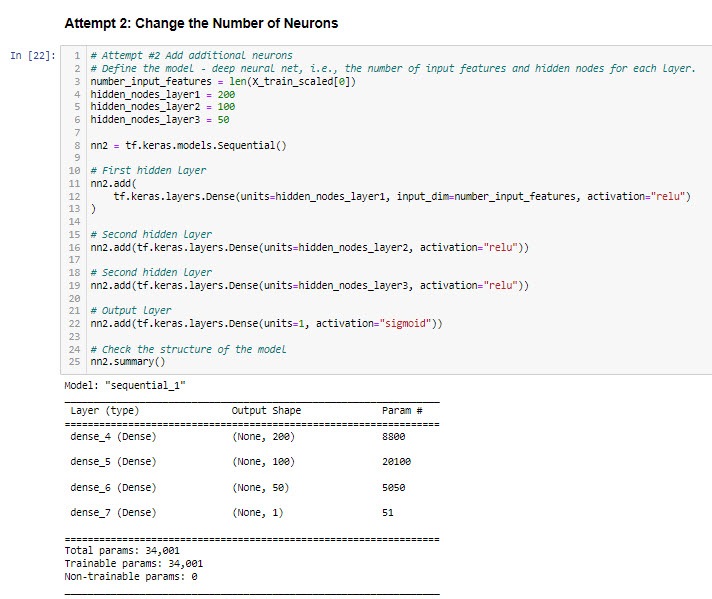

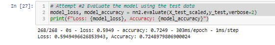

##### Attempt #3: Change the Activation Function

- There were three hidden layers
	- Layer 1: 200. Increased from 132 in Attempt #1.
	- Layer 2: 100 neurons (half of layer 1)
	- Layer 3: 50 neurons (half of layer 2)
	- Activation function (input layers): Tanh (). Negative values are also considered.
	- Activation function (output layer): Sigmoid. The sigmoid activation function is used for binary outputs (`IS_SUCCESSFUL`=Yes/No).
	- Accuracy: 0.7237. Not successful in achieving model performance of 75%.

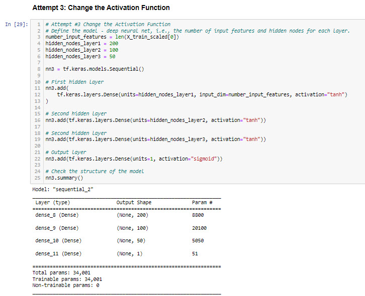

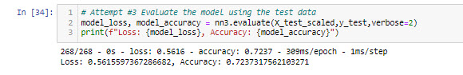

##### Attempt #4: Revert to Attempt #1 and Add Epochs

- There were three hidden layers
	- Epochs increased from 100 to 200
	- Layer 1: 132 neurons (44 inputs * 3). The number of neurons should be 2-3 times the number of inputs
	- Layer 2: 66 neurons (half of layer 1)
	- Layer 3: 33 neurons (half of layer 2)
	- Activation function (input layers): ReLu (). ReLu is the most used activation function in neural networks due to its simplifying output.
	- Activation function (output layer): Sigmoid. The sigmoid activation function is used for binary outputs (`IS_SUCCESSFUL`=Yes/No).
	- Accuracy: 0.7243. Not successful in achieving model performance of 75%.

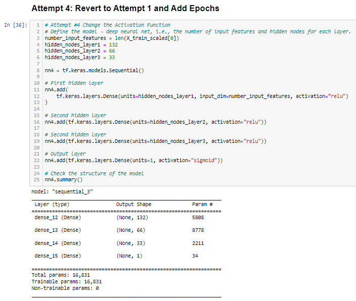

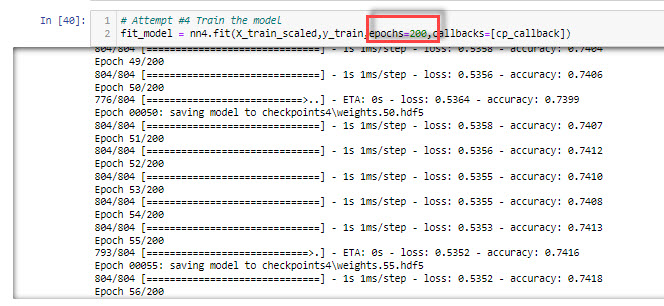

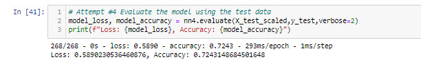

## Summary

Overall, the deep learning model was not very successful in resolving the classification problem. Attempts to optimize the model proved to have very little effect on the outcome. I would recommend using a Random Forest classification model to predict the results of successful donations. Random Forest is an ensemble of Decision Trees where the results of one tree's output is weighted for a certain class. In addition, Random Forest is less prone to overfitting. The neural network might have performed better if we had additional data, whereas the Random Forest model can use a smaller data set.